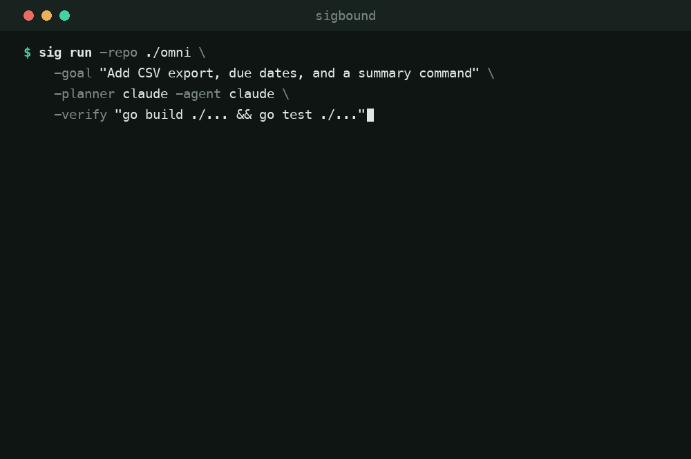
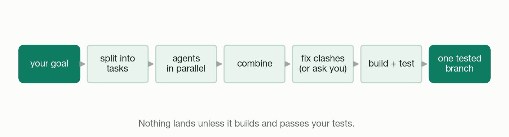
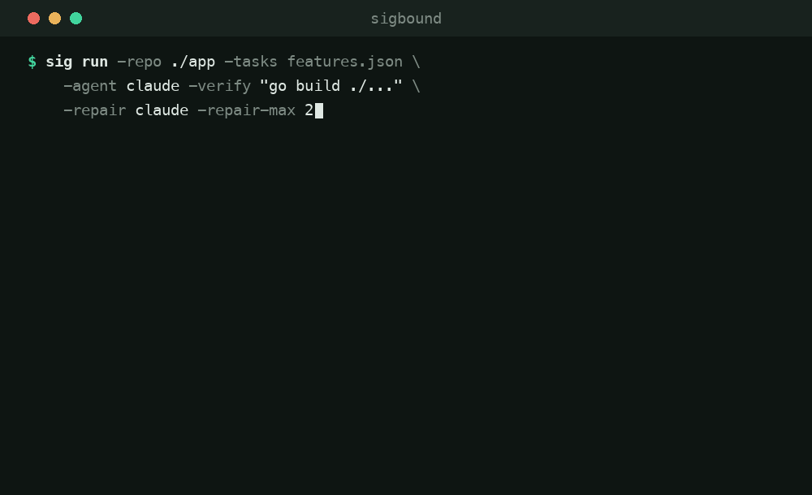
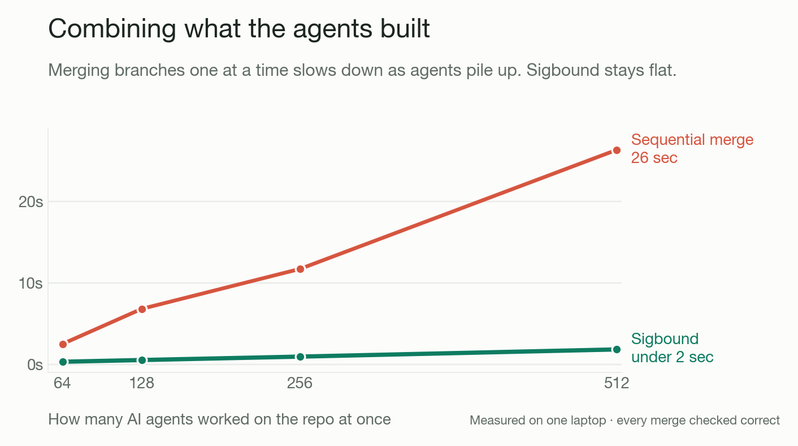
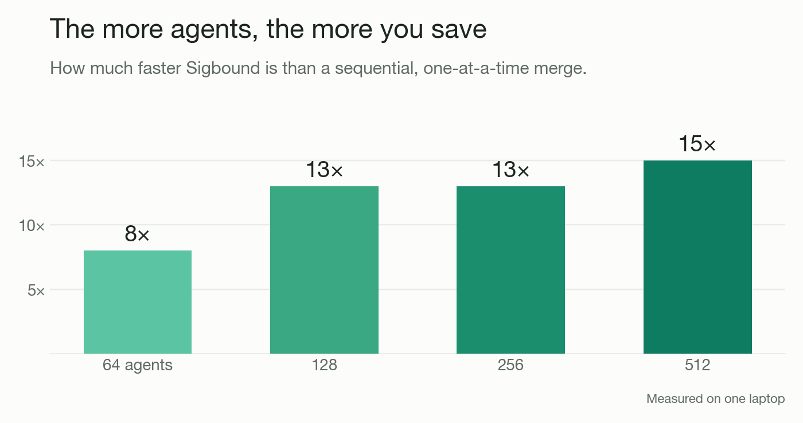

# Sigbound

Run multiple AI coding agents on one repository in parallel, and merge their work automatically — landing only changes that build and pass your tests.

[](#testing)
[](#testing)
[](#testing)
[](go.mod)
[](LICENSE)



## Overview

Tools that run coding agents in parallel give each agent its own git worktree and leave you to merge the results. Merging is where the time goes: two agents edit the same file, or their separate changes combine into code that no longer compiles. One engineer reported spending 30–50% of their parallel-agent time on conflict resolution; another got a clean merge with zero conflicts and still spent six hours fixing a broken build.

Sigbound handles the merge. It splits a task into independent pieces, runs an agent on each, combines the non-conflicting work in parallel, resolves conflicts with a model (and flags anything it is unsure about rather than guessing), and gates every merge on your build and test commands. What comes back is a single branch that compiles and passes.

Every model step — planning, the agents, conflict resolution, repair — is a command you provide, so you use your own model and harness. Sigbound runs on top of plain git and works with any host. It is not a git server and does not replace your existing tools.

Cursor's [Origin](https://cursor.com/origin) announced a closed, hosted version of this idea; it is not yet available. Sigbound is open, runs on your own repository, and works today.

## Features

- **Parallel merge** — non-conflicting changes from many agents are combined at once, not one at a time.
- **Conflict resolution** — a model resolves overlaps; low-confidence cases are flagged for review, never guessed.
- **Verified merges** — nothing lands unless the combined result passes your `-verify` command.
- **Self-repair** — a merge that breaks the build is sent back to an agent to fix, then re-checked.
- **File lanes** — each task declares the files it may touch; an agent that strays is rejected.
- **Bring your own model** — planner, agent, resolver, and repair are each a command you supply.
- **On top of git** — uses worktrees and `merge-tree`; no server, no lock-in, any host.

## Install

```bash
# Homebrew (macOS/Linux)
brew install surya-koritala/tap/sig

# installer script — fetches the right prebuilt binary and verifies its checksum
curl -fsSL https://raw.githubusercontent.com/surya-koritala/sigbound/main/install.sh | sh

# go install
go install github.com/surya-koritala/sigbound/cmd/sig@latest

# from source
git clone https://github.com/surya-koritala/sigbound && cd sigbound
go build -o sig ./cmd/sig
```

Prebuilt archives (with checksums) for macOS, Linux, and Windows are on the
[releases page](https://github.com/surya-koritala/sigbound/releases).

The only runtime requirement is the `git` binary (>= 2.38) — run `sig doctor`
to check. Go 1.25+ is needed only when building from source.

Running in CI? `surya-koritala/sigbound` is also a GitHub Action — see
[GitHub Action](docs/USAGE.md#github-action) in the docs.

## Usage

Run a set of tasks from a file. `examples/tasks.json` describes three features on separate files; each task's file list is enforced.

```bash
./sig run \
  -repo /path/to/your/repo \
  -tasks examples/tasks.json \
  -strategy overlay \
  -agent    'claude -p --permission-mode acceptEdits "$SIGBOUND_TASK"' \
  -resolver 'git merge-file -p --union "$SIGBOUND_OURS" "$SIGBOUND_BASE" "$SIGBOUND_THEIRS"' \
  -verify   'go build ./... && go test ./...' \
  -repair   'claude -p --permission-mode acceptEdits "Fix this build failure: $SIGBOUND_FAILURE"' \
  -json
```

Or start from a goal and let a model plan the tasks:

```bash
./sig run \
  -repo /path/to/your/repo \
  -goal "Add CSV export, due dates, and a summary command" \
  -planner 'claude -p "$SIGBOUND_PROMPT"' -n 3 \
  -agent '...' -resolver '...' -verify 'go build ./... && go test ./...'
```

`-agent`, `-resolver`, `-repair`, and `-planner` are shell commands you supply; the examples use the `claude` CLI, but anything that edits files in the working directory works. Each command receives the relevant `SIGBOUND_*` environment variables.

Typing that `sh -c` wiring by hand is the fiddliest part of a first run, so `-agent-preset`/`-repair-preset`/`-planner-preset` (`claude`, `codex`, `aider`) and `-verify-preset` (`go`, `node`, `python`, `rust`) expand a short name into the known-good command above — an explicit `-agent`/`-verify`/etc. always overrides its preset. Just the `-agent`/`-verify` pair from the first example collapses to:

```bash
./sig run -repo /path/to/your/repo -tasks examples/tasks.json -agent-preset claude -verify-preset go
```

That drops `-resolver` and `-repair` from the first example rather than presetting them: `-repair` has its own `-repair-preset claude|codex|aider` if you want it, but there's no `-resolver-preset` at all — see [Presets](docs/USAGE.md#presets) for every preset's exact expansion.

That invocation is long and doesn't change much run to run — put your standing flags in `sig.conf` (one `key=value` per line; see [Config file](docs/USAGE.md#config-file)) and just pass `-config sig.conf -tasks ...` from then on.

### `sig serve`: an HTTP run API

`sig serve -repos /path/a,/path/b` runs the same engine behind a small local daemon: `POST /runs` starts a run, `GET /runs/{id}` polls it, and a read-only `/ui` page lets you inspect any branch a run flagged for human review. It binds loopback by default, ships no TLS or user model, and adds no new landing path — it drives the exact same `-verify`-gated engine `sig run` does. See [`sig serve`](docs/USAGE.md#sig-serve).

### `sig export` / `sig import`: multi-machine runs

Splitting a batch across machines? A worker runs its agents locally and `sig export`s the resulting branches into one git-bundle file; a coordinator `sig import`s the bundle into an isolated namespace and folds it in with `sig integrate`, same as any local branch. See [Distributed workflow (bundles)](docs/USAGE.md#distributed-workflow-bundles).

## Documentation

[`docs/USAGE.md`](docs/USAGE.md) is the complete reference: every `sig run`, `sig integrate`, and `sigbench` flag, the full set of `SIGBOUND_*` environment variables passed to each command, and the JSON report shape. [`examples/`](examples/) has a runnable quickstart.

`sig version` reports the build; releases follow [Semantic Versioning](https://semver.org) and are recorded in [`CHANGELOG.md`](CHANGELOG.md).

## How it works



Sigbound partitions the work so agents touch different files, runs them in parallel worktrees, then merges. Changes to disjoint files are combined in a single pass; only genuinely overlapping changes are resolved one at a time. Every merge is gated on `-verify`, and a failure is routed to `-repair` before it can land.



When the combined tree fails `-verify`, Sigbound hands the failure to `-repair`, applies the fix, and re-runs `-verify`. Nothing reaches your base branch until it passes.

<details>
<summary>Implementation notes</summary>

Each agent works in its own `git worktree`. Non-overlapping branches are merged directly in git's object database with `git merge-tree` and a tree-overlay fast path — no working tree and no index locks — partitioned by each branch's write-set so disjoint changes commute. Correctness is asserted `trees-equal` against a reference merge on every run. Sigbound shells out to the `git` binary and does not reimplement git.
</details>

## Benchmarks

Merging N agents' branches into one repository, on a single laptop (median of 5 runs, correctness verified on every run).

| Agents | Sigbound | Sequential `git merge` | Speedup |
|-------:|---------:|-----------------------:|--------:|
| 64  | 0.3 s | 4.5 s  | 17× |
| 128 | 0.5 s | 8.1 s  | 17× |
| 256 | 0.8 s | 16.7 s | 22× |
| 512 | 1.4 s | 35.1 s | 25× |



Sequential merging slows down as agents are added, because each merge changes the base for the rest. Parallel integration stays roughly flat, so the advantage grows with the number of agents.



The advantage grows with the number of agents.

Reproduce a table row (or the full agents×overlap sweep):

```bash
go run ./cmd/sigbench -agents 512 -files 2000 -strategy overlay,porcelain -runs 5 -warmup 2
go run ./cmd/sigbench -sweep
```

The fold stays linear well past this table — [`docs/SCALE.md`](docs/SCALE.md)
carries it out to 4096 agents on two machines, with the observed scaling
exponent and where the first bottleneck would be.

## Comparison

| | Parallel agents | Merges the work | AI conflict resolution | Gated on build + test | Self-repair | Open | Available |
|---|:---:|:---:|:---:|:---:|:---:|:---:|:---:|
| GitHub PRs | — | — | — | one PR at a time | — | ✓ | ✓ |
| Parallel runners¹ | ✓ | — | — | — | — | ✓ | ✓ |
| Cursor Origin | ✓ | ✓ | ✓ | ✓ | ✓ | ✗ | waitlist |
| Sigbound | ✓ | ✓ | ✓ | ✓ | ✓ | ✓ | ✓ |

¹ claude-squad, Conductor, and the worktree support built into Claude Code and Codex.

## Testing

- 306 tests, including end-to-end runs against real git repositories.
- Coverage: 83% on the integration engine, 90% on the git plumbing.
- 16 fuzz targets covering every parser of git and model output. Fuzzing found and fixed a bug in the `ls-tree` parser that could have produced a silently incorrect merged tree; the triggering input is kept as a regression test.

```bash
go test -race ./...
```

## Status

Working: the engine, the `sig` CLI, the benchmark, multi-machine execution (`sig export`/`sig import` bundles), and `sig serve` — an HTTP run API with a read-only conflict-review UI — all verified on real repositories.

Sigbound builds on top of git and does not aim to become a git host: `sig serve` runs and lets you inspect work over a repo you already host, it does not host repos, review pull requests, or replace your forge.

## License

[Apache-2.0](LICENSE).

## Contributing

See [CONTRIBUTING.md](CONTRIBUTING.md).
